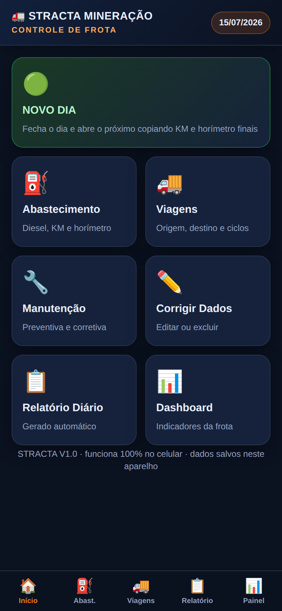
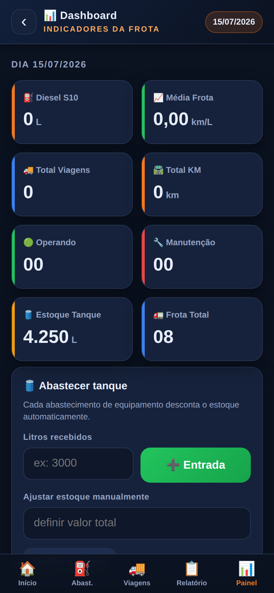
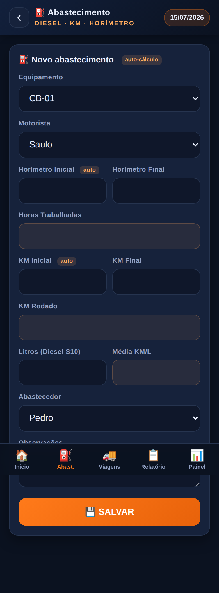

# 🚛 STRACTA · Controle de Frota — V1.0

Sistema **web** de controle de frota da **STRACTA Mineração**, projetado para funcionar **100% no celular**, sem servidor e sem internet obrigatória. Todos os dados ficam salvos no próprio aparelho (`localStorage`) e o app pode ser **instalado como aplicativo** (PWA).

<p align="center">
  
  
  
</p>

## ✨ Funcionalidades (V1.0)

| Módulo | O que faz |
|---|---|
| 🟢 **Novo Dia** | Fecha o dia atual e abre o próximo, **copiando KM Final → KM Inicial** e **Horímetro Final → Horímetro Inicial** de cada equipamento, mantendo o histórico. |
| ⛽ **Abastecimento** | Busca automaticamente o último KM e horímetro, calcula **Horas Trabalhadas**, **KM Rodado** e **Média km/L**, desconta o diesel do tanque e limpa os campos após salvar. |
| 🚚 **Viagens** | Registra várias rotas (Origem → Destino) por equipamento, soma por equipamento e o **total da frota**. |
| 🔧 **Manutenção** | Preventiva, Corretiva, Lubrificação, Calibração e Troca de Óleo. |
| ✏️ **Corrigir Dados** | Editar ou excluir qualquer registro por dia. |
| 📋 **Relatório Diário** | Gerado automaticamente, com resumo geral. Botões de **copiar** e **enviar para o WhatsApp**. |
| 📊 **Dashboard** | Diesel, média da frota, viagens, KM, equipamentos operando/manutenção e estoque do tanque. |

## 📱 Como usar no celular

1. Hospede a pasta em qualquer servidor estático (ex.: **GitHub Pages**) ou abra o `index.html`.
2. No navegador do celular, abra o endereço e use **"Adicionar à tela inicial"**.
3. Pronto — funciona como app, inclusive **offline**.

### GitHub Pages (grátis)
`Settings → Pages → Branch: main → /(root)` e acesse o link gerado.

## 🗂️ Estrutura

```
index.html          Estrutura e telas
css/style.css       Estilo mobile-first (tema mineração)
js/storage.js       Camada de dados (localStorage)
js/app.js           Navegação, telas e cálculos
manifest.json       Configuração do app instalável (PWA)
sw.js               Service worker (offline)
icons/icon.svg      Ícone do app
```

## 🔒 Sobre os dados

Os dados são gravados **apenas neste aparelho**. Para transferir, use os botões de exportação (relatório) até chegar a sincronização em nuvem.

## 🚀 Próximas versões

- ✅ Assinatura digital
- ✅ Fotos dos equipamentos
- ✅ Gráficos / Power BI
- ✅ Aplicativo Android nativo
- ✅ Notificações automáticas
- ✅ Relatório em PDF
- ✅ Exportar para WhatsApp *(já disponível em V1.0)*

---
STRACTA Mineração · Controle de Frota 🚛📊
